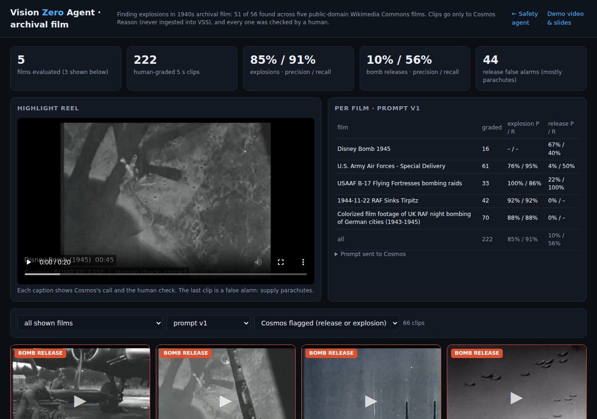
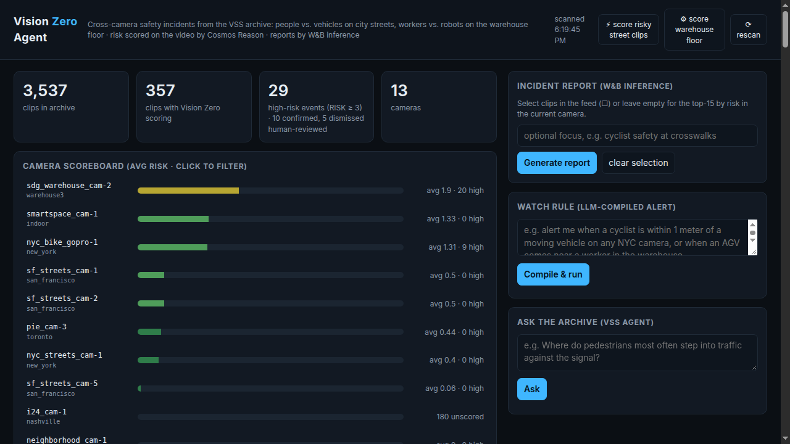
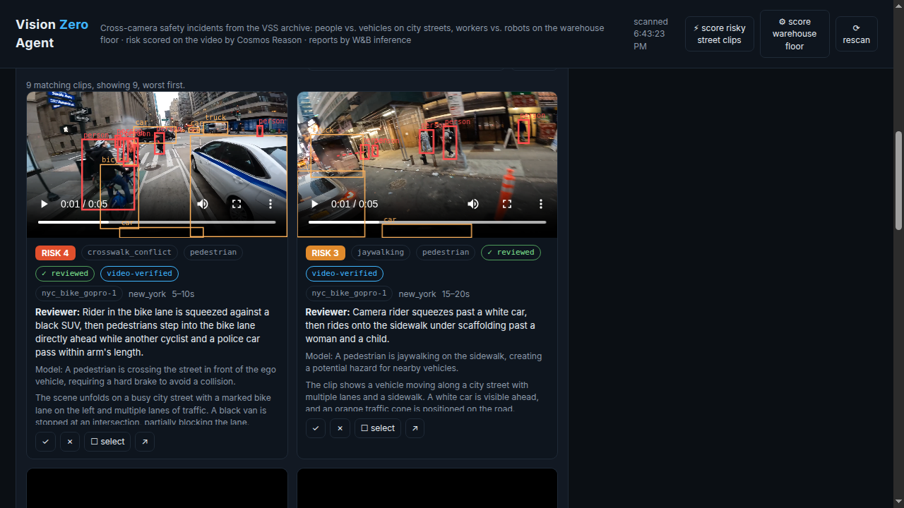
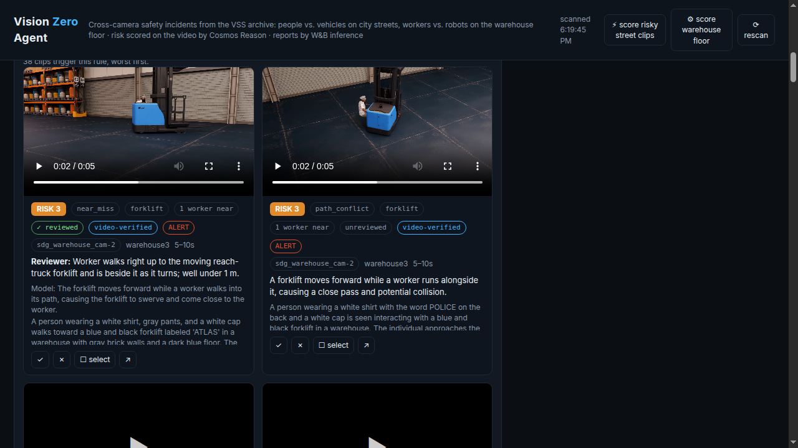
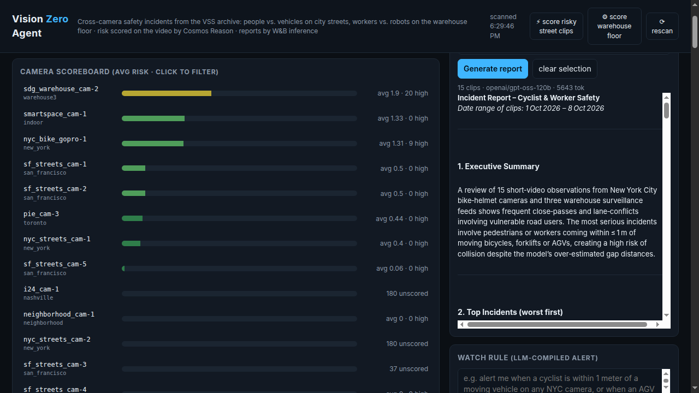
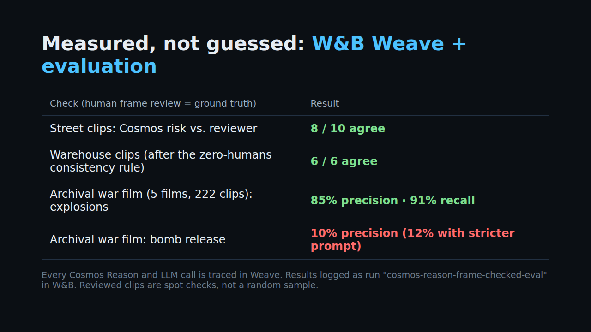

# Vision Zero Agent

**One video agent that finds the moments that matter in hours of footage and checks every finding on the video itself — 51 of 56 explosions found in public-domain archival film, and close calls between people and vehicles or warehouse robots in a live VAST camera archive.**

Built at the VAST Builders Challenge (team-4) on the pre-deployed VSS stack: VAST AI OS for video, vectors and metadata; NVIDIA Cosmos Reason running on CoreWeave GPUs for video understanding; YOLO11 for object boxes; W&B Inference for reports and rule compiling; W&B Weave for tracing and evals; built with Cursor.

**[Demo video (2:37)](https://github.com/jkfnc/vision-zero-agent/releases/download/v1.0-demo/vision_zero_demo.mp4)** · **[Slides (PDF)](https://github.com/jkfnc/vision-zero-agent/releases/download/v1.0-demo/vision_zero_deck.pdf)**



## The story

A news desk gets hours of raw footage from cameras in a conflict zone, two or three hours per feed. Somewhere inside are the five seconds that matter: an explosion. Nobody can sit and watch every feed live, and by the time someone scrubs through it, the moment has passed.

Vision Zero Agent watches for them. It cuts each incoming feed into 5 s segments and sends each one to NVIDIA Cosmos Reason as it arrives. When Cosmos sees an explosion, the agent saves the clip and alerts the desk: a pop-up and chime on the page, a desktop notification, and an email or webhook with the clip. On three films it had never seen, every blast raised an alert, with no false alarms in 36 segments; across 222 hand-checked archival clips it found 51 of 56 explosions.

The same agent protects people on everyday cameras: on city streets it flags cars cutting close to pedestrians and cyclists, and on warehouse floors it flags workers stepping into the path of forklifts and robots. Hours of footage, a few seconds that matter, found and checked on the video itself.

## What it does

| Feature | How |
|---|---|
| **Archival film mode** (`/war`) | Five public-domain Wikimedia Commons films (1943–1946), every 5 s clip watched by Cosmos Reason, 222 clips hand-checked. Explosions: 51 of 56 found (91 % recall, 85 % precision). Each clip card shows Cosmos's call, the human check, and a live “Run Cosmos now” button. |
| **Live explosion trigger** (`/war`) | Treats a film as an incoming feed: ffmpeg cuts it into 5 s segments as it arrives, each segment goes to Cosmos Reason with the bomb/explosion prompt, and on a match the segment is saved and an alert email is sent (SMTP) and/or posted to a webhook. Test run on the Tirpitz film: 10 of 24 segments flagged, each with its clip and alert. The page pops a toast for every new alert (click to jump to the clip), plays a chime, counts unread alerts in the tab title and the header bell, and sends a desktop notification when the tab is in the background. API: `POST /api/war/live/start {film, max_segments, realtime}`, `GET /api/war/live`, `POST /api/war/live/stop`. |
| **Custom-prompt re-index** | We re-indexed street cameras in VSS with our own Cosmos prompt (below) so every caption carries machine-readable `RISK / EVENT / MIN_GAP_M / VULNERABLE / WHY` lines. These become searchable and parseable across ~3,500 clips. |
| **Video-verified risk scoring** | For clips that matter, the app sends the actual 5 s MP4 to Cosmos Reason with a domain-specific prompt (street or warehouse) and stores the structured score. 346 clips scored this way. |
| **Warehouse mode** | AGVs, humanoid robots and forklifts vs. workers: `path_conflict`, `human_in_robot_path`, `contact`, `blocked_aisle`. A consistency rule zeroes risk when Cosmos reports no human near a machine. |
| **Bounding boxes** | Per-frame YOLO11 detections from VSS are drawn over each playing clip: people red in risky clips (green otherwise), vehicles amber, a dashed red line to the nearest person–machine pair. |
| **Human review loop** | Confirm / dismiss each alert with a note; confirmed incidents rank first and override the model in reports. |
| **Natural-language watch rules** | “Alert when a forklift comes within 1 m of a worker” → JSON filter compiled by `gpt-oss-120b` on W&B Inference, then run over every scored clip to give a rule-matched alert feed. |
| **Incident reports** | One click: worst incidents with clip citations, cross-camera patterns, recommended actions. |
| **Observability** | Every Cosmos and LLM call is a `weave.op`; eval tables (model vs. human verdict) are logged to W&B. |

## Results

| Domain | Measure | Result |
|---|---|---|
| Archival film: explosions | 222 hand-checked clips, 56 real explosions (prompt v1) | **51 of 56 found: 91 % recall, 85 % precision** (v2: 88 % precision, 80 % recall) |
| Live explosion trigger | 3 films not used in tuning (1957 A-bomb newsreel, 1946 Bikini underwater test, 1952 Ivy Mike), 36 segments, human frame check | **3 of 3 blasts alerted, 0 false alarms**; 13 of 21 explosion segments flagged (misses: first flash before the cloud forms, colour fireball close-ups read as a sunset). See [`war-eval/live/live_eval.json`](war-eval/live/live_eval.json) |
| Street (Vision Zero) | agreement with human review (risk ≥ 2 vs. verdict) | 8 / 10 |
| Warehouse | agreement with human review | 5 / 6 raw → 6 / 6 after the no-human consistency rule |
| Archival film: bomb releases (known limit) | 9 real releases (prompt v2) | 12 % precision / 67 % recall — Cosmos confuses parachutes, cargo drops and flak with bombs |

Explosions are the best-supported number we have (56 real events across 5 films). Bomb releases are an honest negative result: a 5 s clip at low resolution is often not enough to tell a bomb from a parachute, and a stricter prompt barely helped (precision 4.0 % → 4.2 % on the hardest film).

## Custom prompts

All prompts we wrote, verbatim. Files are in [`prompts/`](prompts/) and [`app/`](app/).

### 1. VSS re-index + street scoring prompt (Cosmos Reason)

Used twice: as the `custom_prompt` for `POST /api/v1/dashboard/reingest` on three street streams (NYC bike GoPro, NYC street cam 1, PIE set03), and for on-demand video scoring of street clips. 715 characters (VSS limit 800).

```text
You are auditing this clip for street safety (Vision Zero). In 2-3 sentences describe: camera type (dashcam, fixed street cam, or cyclist helmet cam), road layout, signal state, weather/lighting, and what each pedestrian, cyclist and vehicle is doing. Then output exactly these lines:
RISK: <0-5>
EVENT: <none|near_miss|crosswalk_conflict|bike_lane_blocked|hard_brake|red_light_run|dooring|jaywalking|illegal_turn>
PEDS_IN_ROAD: <count>
CYCLISTS: <count>
MIN_GAP_M: <closest person-to-moving-vehicle distance in meters>
VULNERABLE: <pedestrian|cyclist|wheelchair|child|none>
WHY: <one sentence naming the riskiest interaction>
RISK 0 only if no road users interact. RISK 4-5 only for imminent collision or contact.
```

### 2. Warehouse scoring prompt (Cosmos Reason)

Sent with the clip video for the `smartspace` and `sdg_warehouse` cameras. (We tried a stricter “calibrated” version; it lost real near misses, so we kept this one.)

```text
You are a warehouse safety auditor watching an overhead camera. Track every moving machine (AGV/pallet robot, humanoid robot, forklift) and every human worker. Decide whether any machine comes close to a human while either is moving. Output exactly these lines:
RISK: <0-5>
EVENT: <none|near_miss|path_conflict|contact|blocked_aisle|human_in_robot_path>
MACHINE: <agv|humanoid|forklift|none>
HUMANS_NEAR: <number of humans within 2 meters of a moving machine>
MIN_GAP_M: <closest human-to-moving-machine distance in meters, estimated from body sizes>
WHY: <one sentence naming the machine, the person and what they do>
RISK 0 if no machine moves near a person. RISK 2 for a pass within 2 m. RISK 3-4 for within 1 m or a sudden stop/swerve. RISK 5 only for contact.
```

Post-processing rule: if `HUMANS_NEAR: 0` and `RISK > 0`, risk is set to 0 and event to `none` (Cosmos returned risk 2 with nobody near on 38 clips).

### 3. War film prompt v1 (Cosmos Reason)

```text
You are cataloguing archival military film. Watch the whole clip and report only what is visible. Output exactly these lines:
SCENE: <aircraft_in_flight|ground_view|aerial_view_of_ground|crew_or_cockpit|title_or_map|other>
BOMB_RELEASE: <yes|no> (a bomb or rocket leaves an aircraft)
BOMB_FALLING: <yes|no> (a bomb is visible in the air)
IMPACT: <yes|no> (an explosion, blast cloud or smoke burst on the ground)
WHY: <one sentence describing what is visible>
```

### 4. War film prompt v2 (Cosmos Reason, used in the live `/war` page)

Adds an explicit definition of a bomb and a list of look-alikes. Cosmos sometimes echoed this definition back as its justification for false alarms.

```text
You are cataloguing archival military film. Report only what is visible. A bomb is a finned, streamlined metal munition leaving a bomb bay or wing rack, or falling through the air. NOT bombs: parachutes, paratroopers, parachuted supply containers, cargo pushed from doors, leaflets, or aircraft simply flying. Output exactly these lines:
SCENE: <aircraft_in_flight|ground_view|aerial_view_of_ground|crew_or_cockpit|title_or_map|other>
BOMB_RELEASE: <yes|no> (a bomb leaves an aircraft)
BOMB_FALLING: <yes|no> (a bomb is visible in the air)
IMPACT: <yes|no> (an explosion, blast cloud or smoke burst on the ground)
WHY: <one sentence describing what is visible>
```

### 5. Incident report system prompt (`gpt-oss-120b` on W&B Inference)

`{role}` and `{actions}` switch between street, warehouse, or both, depending on the selected clips (see `incident_report` in [`app/main.py`](app/main.py)).

```text
You are {role}. You are given machine-generated observations of short video clips from multiple cameras. Write a concise incident report in markdown: 1) Executive summary (2-3 sentences). 2) Top incidents, worst first, each citing the clip number in [n] form, with what happened and who was at risk. 3) Patterns across cameras/locations. 4) Recommended actions ({actions}), each tied to evidence. Never invent details not in the observations. Machine distance estimates are rough and tend to overstate gaps. Where a human reviewer note is present it overrides the model's 'why'; lead with reviewer-confirmed clips and label unreviewed ones as unverified.
```

- street role: “a Vision Zero traffic-safety analyst”; actions: “engineering, enforcement, education”
- warehouse role: “a warehouse safety analyst auditing robot/AGV/forklift interactions with workers”; actions: “aisle layout, robot speed limits and geofencing, PPE, training”

### 6. Watch-rule compiler system prompt (`gpt-oss-120b` on W&B Inference)

```text
Convert a street- or warehouse-safety watch rule into JSON with keys: min_risk (0-5; use 0 unless the rule names a severity), events (list from <all event types>; only when the rule names a specific kind of event such as a red light or dooring, leave empty for general 'comes near' or 'close call' rules), vulnerable (street road users only: list from pedestrian,cyclist,wheelchair,child or empty; leave empty for warehouse workers), machines (list from agv,humanoid,forklift or empty), cameras (list of camera_id values from the known cameras that match any place/camera mentioned, e.g. 'NYC' -> all new_york cameras, 'warehouse' or 'robots' -> smartspace and sdg_warehouse cameras; empty if none mentioned), max_gap_m (number if the rule mentions a distance like 'within 1 meter', else null), query (short natural-language search phrase). Known cameras: <camera list>. Return only JSON.
```

Rule matching then adds: any proximity event implies all proximity events, distance rules accept `gap <= max_gap_m + 0.5`, and alerts need `risk >= max(1, min_risk)`.

## Architecture

```
VSS archive (VAST DataBase + S3)  ──explore/search──▶  app/main.py  ──▶  browser (app/index.html, app/war.html)
   ▲ custom-prompt re-index                 │  ├─ clip MP4 ─▶ Cosmos Reason (CoreWeave GPU)  → structured risk
   │                                        │  ├─ detections ─▶ YOLO11 boxes (from VSS sidecar)
   NVIDIA Cosmos Reason captions            │  ├─ reports / rules ─▶ gpt-oss-120b (W&B Inference)
                                            │  └─ every call ─▶ W&B Weave traces
   team VM: deploy/fileserver.py ──▶ demo assets + public-domain war clips (never ingested into VSS)
```

- `app/` — stdlib-only Python server (`ThreadingHTTPServer`, `urllib`) plus `weave`; single-file HTML front ends. Runs on Kubernetes from a ConfigMap at Ingress path `/app`.
- `war-eval/` — scripts that segment the films, score clips with Cosmos (`score_local.py`), build grading sheets, compute metrics and cut the highlight reel. `eval_films.json` holds every graded clip with both prompt versions; `attribution.json` lists sources and licenses.
- `demo/` — the narrated demo video pipeline: Piper TTS (`tts.sh`, runs in a throwaway K8s pod), ffmpeg scene builder (`build_video.py`), box burn-in (`burn_boxes.py`), HTML slides.
- `deploy/` — the internal file server (HTTP Range support, symlink-escape protection) and the public-folder builder.

## Running it

Environment variables (no defaults for endpoints or secrets):

| Variable | Purpose |
|---|---|
| `VSS_URL`, `VSS_USERNAME`, `VSS_PASSWORD` | VSS backend API |
| `COSMOS3_REASON_URL`, `GPU_BEARER_TOKEN` | Cosmos Reason endpoint |
| `WANDB_API_KEY`, `WANDB_TEAM`, `WANDB_PROJECT` | W&B Inference |
| `WEAVE_WANDB_API_KEY`, `WEAVE_PROJECT` | optional: Weave tracing to a different W&B account |
| `VZ_FILES_URL` | optional: file server for demo assets and war clips (also the live trigger's source films) |
| `SMTP_HOST`, `SMTP_PORT` (587), `SMTP_USER`, `SMTP_PASSWORD`, `ALERT_EMAIL_TO`, `ALERT_EMAIL_FROM` | optional: live-trigger alert email (STARTTLS). Without them the alert keeps an email draft |
| `ALERT_WEBHOOK_URL` | optional: also POST `{"text": ...}` alerts to a Slack-style webhook |
| `VZ_PUBLIC_URL` | optional: public base URL used for clip links inside alert emails |

```bash
cd app && pip install -r requirements.txt && python main.py   # serves on $PORT (default 8080)
python deploy/fileserver.py <bind-ip> 8088                    # optional, serves ~/vision-zero-work/public
```

Seed files `video_scores.json` and `reviews.json` (pre-computed scores and human reviews) are not in the repo because they contain team-specific storage paths; the app starts without them and scores clips on demand.

## Data and licensing

- Street and warehouse clips are the VSS sample archive provided at the event; no internet video was ingested into VSS.
- War footage: public-domain films from Wikimedia Commons (US Army, USAAF, Universal Newsreels, RAF). Clips were sent only to the Cosmos endpoint for evaluation. The B-17 film carries an AP watermark and the RAF film is colorized, so those two are used for statistics only and not shown. See [`war-eval/attribution.json`](war-eval/attribution.json). Live-trigger test films (public domain: Universal Newsreel, U.S. Military, U.S. Department of Energy): [`war-eval/live/attribution.json`](war-eval/live/attribution.json).
- Narration voice: Piper `en_US-lessac-medium` (research / non-commercial voice license).

## Screenshots

| | |
|---|---|
|  |  |
|  |  |
|  |  |
